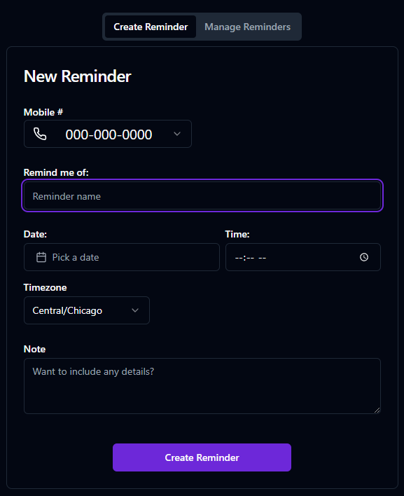

<a name="readme-top"></a>

<h1 align="center">

Remindas</h1>

  <h4 align="center">Send yourself reminders so you don't forget stuff</h4> 
    <br />
    <br />
    <div align='center'>   
        <a href="https://remindas.vercel.app/">View Live</a>
        ·
        <a href="https://github.com/FlapShatner/remindas/issues">Report Bug</a> 
   </div>

<!-- ABOUT THE PROJECT -->

<br><br>

Remindas is a web app written in TypeScript using Next.js.
Using it, users can create an account and set reminders for the future. At the specified date and time, an SMS message will be sent to their phone number with whatever message they decided to write.
<br>
<br>


<br>
<br>

#### Built With:

- [![Next][Next.js]][Next-url]
- [![React][React.js]][React-url]
- [![TailwindCSS][TailwindCSS]][Tailwind-url]
- [![Typescript][Typescript]][Typescript-url]
- [![Prisma][Prisma]][Prisma-url]
- [![Twilio][Twilio]][Twilio-url]

<br>
Auth and user management is handled with Clerk, with Planetscale to store user's reminder data. SMS messages are sent using Twilio's messaging API. Shadcn/ui is implemented as the UI components and all styling is in Tailwind.
<br>

## Usage example

Using Remindas is easy. Just create an account with your google account, email or phone number,

<br>


<br>
Then add your phone number and start creating reminders

<br>



<br>

You can view and delete your scheduled or sent reminders from the Manage Reminders tab

<br>


<br>
<br>

## Development setup

#### Installation

1. [Fork](https://docs.github.com/en/get-started/quickstart/fork-a-repo) and [clone](https://docs.github.com/en/get-started/quickstart/fork-a-repo#cloning-your-forked-repository) the repo

```sh
git clone https://github.com/FlapShatner/remindas.git
```

2. Install NPM packages

```sh
npm install
```

3. Create accounts with Planetscale, Clerk, and Twilio
4. Provide environmental variables

```
TWILIO_ACCOUNT_SID=xxxxxxxxxxxxxxxxxxxxxxxxxxxxxxxxxx
TWILIO_AUTH_TOKEN=xxxxxxxxxxxxxxxxxxxxxxxxxxxxxxxxxx
TWILIO_PHONE_NUMBER=+xxxxxxxxxx
DATABASE_URL='mysql://xxxxxxxxxxxxxxxxxxxxxxxxxxxxxxxxxx
PLANETSCALE_USERNAME=xxxxxxxxxxxxxxxxxxxxxxxxxxxxxxxxxx
NEXT_PUBLIC_CLERK_PUBLISHABLE_KEY=xxxxxxxxxxxxxxxxxxxxxxxxxxxxxxxxxx
CLERK_SECRET_KEY=xxxxxxxxxxxxxxxxxxxxxxxxxxxxxxxxxx
```

5. Generate Prisma schema and push it to your Planetscale DB

```sh
npx prisma generate
npx prisma db push
```

5. Run the app

```sh
npm run dev
```

6. Deploy to host of your choice (I use Vercel)

[![Vercel][Vercel]][Vercel-url]

<br>

### Contributing

1. Create a new branch

```shell
git checkout -b 'your-branch-name'
```

2. Make changes.
3. Push your branch to the upstream repo

```shell
git push origin your-branch-name
```

4. 🎉 Follow the link provided to create a pull request 🎉

## Meta

Your Name – [@YourTwitter](https://twitter.com/dbader_org) – YourEmail@example.com

Distributed under the XYZ license. See `LICENSE` for more information.

[https://github.com/yourname/github-link](https://github.com/dbader/)

## Contributing

1. Fork it (<https://github.com/yourname/yourproject/fork>)
2. Create your feature branch (`git checkout -b feature/fooBar`)
3. Commit your changes (`git commit -am 'Add some fooBar'`)
4. Push to the branch (`git push origin feature/fooBar`)
5. Create a new Pull Request

<!-- Markdown link & img dfn's -->

[Next.js]: https://img.shields.io/badge/next.js-000000?style=flat-square&logo=nextdotjs&logoColor=white
[Next-url]: https://nextjs.org/
[React.js]: https://img.shields.io/badge/React-20232A?style=flat-square&logo=react&logoColor=61DAFB
[React-url]: https://reactjs.org/
[TailwindCSS]: https://img.shields.io/badge/tailwindcss-%2338B2AC.svg?style=flat-square&logo=tailwind-css&logoColor=white
[Tailwind-url]: https://tailwindcss.com/
[TypeScript]: https://img.shields.io/badge/typescript-%23007ACC.svg?style=flat-square&logo=typescript&logoColor=white
[TypeScript-url]: https://www.typescriptlang.org/
[Vercel]: https://img.shields.io/badge/vercel-%23000000.svg?style=flat-square&logo=vercel&logoColor=white
[Vercel-url]: https://vercel.com/
[Prisma]: https://img.shields.io/badge/Prisma-3982CE?style=flat-square&logo=Prisma&logoColor=white
[Prisma-url]: https://www.prisma.io/docs
[Twilio]: https://img.shields.io/badge/Twilio-F22F46?style=flat-square&logo=Twilio&logoColor=white
[Twilio-url]: https://www.twilio.com
